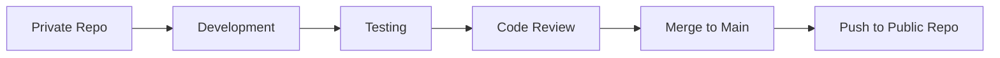

# 🏥 MediNova - Hospital Management System

> **Private Development Repository** - This is the private development workspace for MediNova. All features are developed and tested here before being pushed to the main public repository.

## 🚀 Quick Start

```bash
# Clone the repository
git clone https://github.com/Alex-S07/MediNova_prv.git
cd MediNova_prv

# Install dependencies
npm install

# Start development server
npm run dev
```

## 📋 Table of Contents

- [About the Project](#about-the-project)
- [Features](#features)
- [Tech Stack](#tech-stack)
- [Installation](#installation)
- [Usage](#usage)
- [API Documentation](#api-documentation)
- [Contributing](#contributing)
- [Development Workflow](#development-workflow)
- [License](#license)

## 🎯 About the Project

MediNova is a comprehensive hospital management system designed to streamline healthcare operations, improve patient care, and enhance administrative efficiency.

### Key Objectives
- 📊 Centralize patient information management
- 🏥 Optimize hospital resource allocation
- 👩‍⚕️ Enhance healthcare provider workflows
- 📈 Improve operational analytics and reporting

## ✨ Features

### 🔧 Current Features
- [ ] **Patient Management**
  - Patient registration and profiles
  - Medical history tracking
  - Appointment scheduling
- [ ] **Staff Management**
  - Doctor and nurse profiles
  - Shift scheduling
  - Role-based access control
- [ ] **Inventory Management**
  - Medical equipment tracking
  - Pharmaceutical inventory
  - Supply chain management
- [ ] **Billing & Insurance**
  - Automated billing system
  - Insurance claim processing
  - Payment tracking

### 🚧 Planned Features
- [ ] **Telemedicine Integration**
- [ ] **Mobile App Support**
- [ ] **AI-Powered Analytics**
- [ ] **Multi-language Support**

## 🛠️ Tech Stack

**Frontend:**
- React.js / Next.js
- TypeScript
- Tailwind CSS
- Material-UI

**Backend:**
- Node.js
- Express.js
- MongoDB / PostgreSQL
- JWT Authentication

**DevOps:**
- Docker
- GitHub Actions
- AWS / Azure

## 📦 Installation

### Prerequisites
- Node.js (v14 or higher)
- npm or yarn
- MongoDB / PostgreSQL
- Git

### Step-by-step Installation

1. **Clone the repository**
   ```bash
   git clone https://github.com/Alex-S07/MediNova_prv.git
   cd MediNova_prv
   ```

2. **Install dependencies**
   ```bash
   npm install
   # or
   yarn install
   ```

3. **Environment Setup**
   ```bash
   cp .env.example .env
   # Edit .env with your configuration
   ```

4. **Database Setup**
   ```bash
   npm run db:migrate
   npm run db:seed
   ```

5. **Start the application**
   ```bash
   npm run dev
   ```

## 🎮 Usage

### For Developers

```bash
# Development server
npm run dev

# Run tests
npm test

# Build for production
npm run build

# Lint code
npm run lint

# Format code
npm run format
```

### For Testing

1. Navigate to `http://localhost:3000`
2. Use test credentials:
   - **Admin:** `admin@medinova.com` / `admin123`
   - **Doctor:** `doctor@medinova.com` / `doctor123`
   - **Nurse:** `nurse@medinova.com` / `nurse123`

## 📚 API Documentation

### Authentication Endpoints
```http
POST /api/auth/login
POST /api/auth/register
POST /api/auth/logout
GET  /api/auth/profile
```

### Patient Management
```http
GET    /api/patients
POST   /api/patients
GET    /api/patients/:id
PUT    /api/patients/:id
DELETE /api/patients/:id
```

### Appointment System
```http
GET    /api/appointments
POST   /api/appointments
PUT    /api/appointments/:id
DELETE /api/appointments/:id
```

> 📖 **Full API Documentation:** [View Swagger Docs](http://localhost:3000/api-docs)

## 🤝 Contributing

We welcome contributions! Please follow these steps:

1. **Fork the repository**
2. **Create a feature branch**
   ```bash
   git checkout -b feature/amazing-feature
   ```
3. **Commit your changes**
   ```bash
   git commit -m 'Add some amazing feature'
   ```
4. **Push to the branch**
   ```bash
   git push origin feature/amazing-feature
   ```
5. **Open a Pull Request**

### Coding Standards
- Follow ESLint configuration
- Write unit tests for new features
- Update documentation as needed
- Use conventional commit messages

## 🔄 Development Workflow



### Branch Strategy
- `main` - Production-ready code
- `develop` - Integration branch
- `feature/*` - New features
- `bugfix/*` - Bug fixes
- `hotfix/*` - Critical fixes

## 📈 Project Status


### Development Progress
- [x] Project Setup
- [x] Basic Architecture
- [ ] Core Features (60% complete)
- [ ] Testing Suite (30% complete)
- [ ] Documentation (70% complete)
- [ ] Deployment Pipeline

## 👥 Team

- **Alex-S07** - Lead Developer
- **Joseph Alexander** - Full Stack Developer

## 📞 Support

- 📧 Email: support@medinova.com
- 💬 Discord: [Join our server](https://discord.gg/medinova)
- 📝 Issues: [GitHub Issues](https://github.com/Alex-S07/MediNova_prv/issues)

## 📄 License

This project is licensed under the MIT License - see the [LICENSE](LICENSE) file for details.

---

### 🔒 Security Notice
This is a private development repository. Do not commit sensitive information such as:
- Database credentials
- API keys
- Patient data
- Production configurations

### 🚀 Ready to Deploy?
When features are stable and tested, they will be merged and pushed to the public repository: [MediNova Public](https://github.com/Alex-S07/MediNova)

---

**Made with ❤️ by the MediNova Team**
